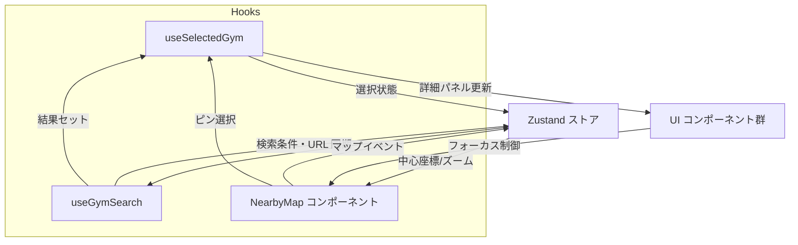

# アーキテクチャ概要

FE10 以降の改善計画に合わせ、FastAPI + Next.js + MapLibre 構成の全体像を整理する。

## 論理構成図

```mermaid
flowchart LR
    U[ユーザー] -->|HTTPS| N[Next.js 14 \n (SSR/CSR)]
    subgraph Frontend
        N
    end
    N -->|REST API| F[FastAPI]
    subgraph Backend
        F -->|SQLAlchemy| P[(PostgreSQL)]
    end
    subgraph Preview
        Dev[開発者] -->|Render Preview URL| T[Preview 環境]
        T --> N
        T --> F
    end
```

## フロントエンド内部データフロー



## 関連ドキュメント

- [短期ロードマップ](./roadmap-next.md)
- [テスト戦略](./testing-strategy.md)
- [パフォーマンス方針](./performance.md)
- [FE10 改善計画の進捗サマリー](./fe10-progress.md)

## PR プレビュー運用メモ

- Render のプレビュー機能を利用し、`render.yaml` に基づくサービス定義で PR ごとに Preview Deploy が生成される。
- データベースやシークレットは Render のダッシュボード上で管理し、GitHub Actions から AWS へ接続する処理は廃止した。
- プレビュー URL は Render が払い出すドメインを利用し、API・フロントとも Render 側のヘルスチェックで監視する。
- インフラ構成や起動パラメータは Render 側に集約しているため、プレビュー運用時は Render ダッシュボードを一次参照とする。
