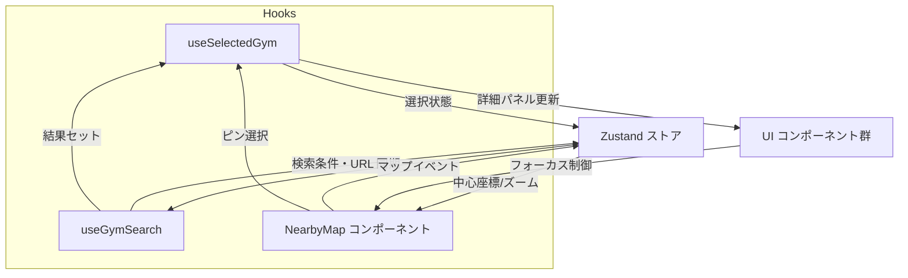

# アーキテクチャ概要

FE10 以降の改善計画に合わせ、FastAPI + Next.js + MapLibre 構成の全体像を整理する。

## 論理構成図

```mermaid
flowchart LR
    U[ユーザー] -->|HTTPS| N[Next.js 14 \n (SSR/CSR)]
    subgraph Frontend
        N
    end
    N -->|REST API| F[FastAPI]
    subgraph Backend
        F -->|SQLAlchemy| P[(PostgreSQL)]
    end
    subgraph Preview
        Dev[開発者] -->|AWS SSM Session Manager トンネル| T[Preview トンネル]
        T --> N
        T --> F
    end
```

## フロントエンド内部データフロー



## 関連ドキュメント

- [短期ロードマップ](./roadmap-next.md)
- [テスト戦略](./testing-strategy.md)
- [パフォーマンス方針](./performance.md)
- [FE10 改善計画の進捗サマリー](./fe10-progress.md)

## PR プレビュー運用メモ

- AWS IAM Identity Center で `gym-preview` プロファイルを作成し、SSO 認証後に SSM ポートフォワーディングでプレビューへ接続する。
- EC2 インスタンスは GitHub Actions からシングルトン upsert し、`Purpose=pr-preview-singleton` などのタグで追跡する。
- Docker/Compose を `user-data` で配備し、API・フロントを起動して `/readyz` や `/healthz` を SSM から確認する。
- EventBridge Scheduler により 2〜4 時間で自動終了するため、長時間のプレビューは再実行が必要。
- 障害時は `docker compose logs`, `cloud-init-output.log`, `/tmp/seed.log` を SSM で収集し、DB シードは自動投入せず手動で管理する。
